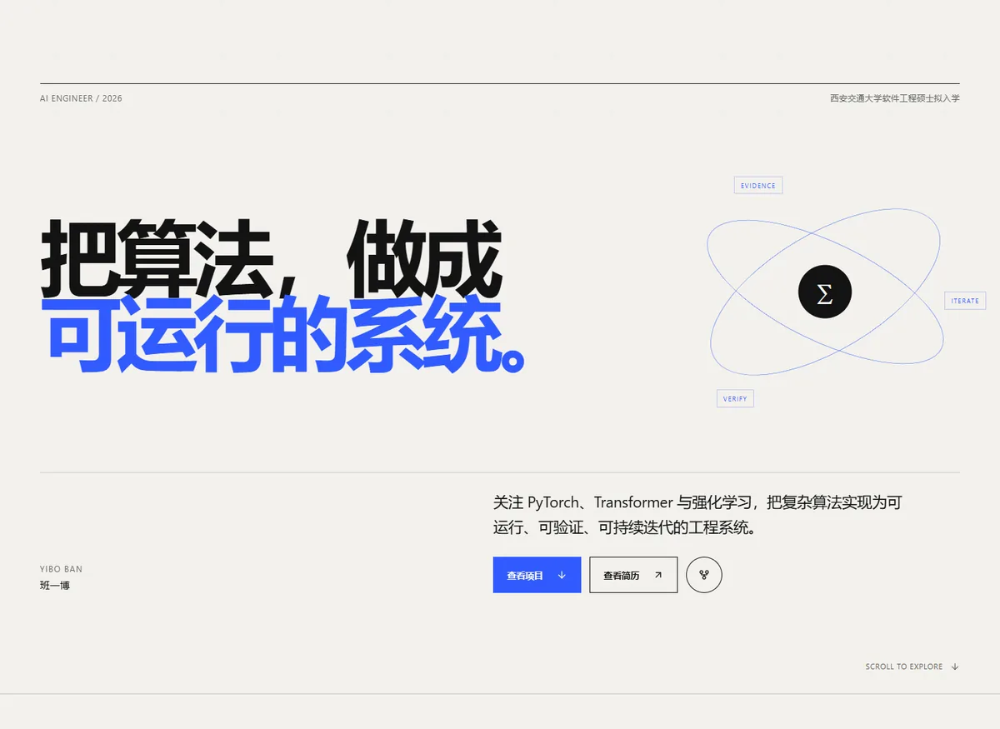

# 班一博 · Personal Portfolio

班一博的技术个人主页，围绕 PyTorch、Transformer、强化学习与 AI 工程实践，展示三个经过仓库内容核验的核心项目：TrainMedic、DLCode 与 MyTransformer。

**在线访问：** [https://yiboban.github.io](https://yiboban.github.io)



## 技术栈

- React 19 + TypeScript
- Vite
- 原生 CSS（响应式布局、克制动效、`prefers-reduced-motion`）
- Lucide Icons
- GitHub Actions + GitHub Pages

## 本地运行

需要 Node.js 22 或兼容版本。

```bash
npm install
npm run dev
```

开发地址默认为 `http://localhost:5173`。

## 质量检查与构建

```bash
npm run lint
npm run build
npm run preview
```

生产构建输出到 `dist/`。该仓库使用用户主页域名，因此 `vite.config.ts` 中的 `base` 为 `/`。

## GitHub Pages 部署

`.github/workflows/deploy.yml` 会在 `main` 分支推送后自动执行：

1. 安装锁定依赖；
2. 运行 lint；
3. 构建生产产物；
4. 上传并部署到 GitHub Pages。

仓库 Pages Source 需要设置为 **GitHub Actions**。

## 内容维护

- 个人信息、能力、项目、经历和荣誉：`src/data/portfolio.ts`
- 页面区块：`src/sections/`
- 复用组件：`src/components/`
- 全局视觉与响应式规则：`src/styles/global.css`
- 项目图片与分享图：`public/images/`
- 简历 PDF：`public/resume/Ban-Yibo-Resume.pdf`
- SEO 与结构化信息：`index.html`

替换简历时保留相同文件名即可；若修改名称，需要同步更新 `Hero.tsx` 与 `Resume.tsx` 中的链接。

## 目录结构

```text
.
├── .github/workflows/deploy.yml
├── docs/site-preview.webp
├── public/
│   ├── images/
│   └── resume/
├── src/
│   ├── components/
│   ├── data/
│   ├── sections/
│   ├── styles/
│   ├── types/
│   ├── App.tsx
│   └── main.tsx
├── index.html
├── package.json
└── vite.config.ts
```

## 内容边界

项目文案以对应 GitHub 仓库的最新 README、代码、测试与 CI 状态为主，简历为补充依据。MyTransformer 被明确描述为教学脚手架，其核心 TODO 按设计保留，不将 Scaffold CI 表述为已完成模型。
